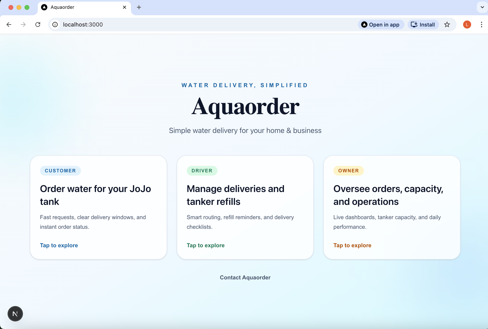
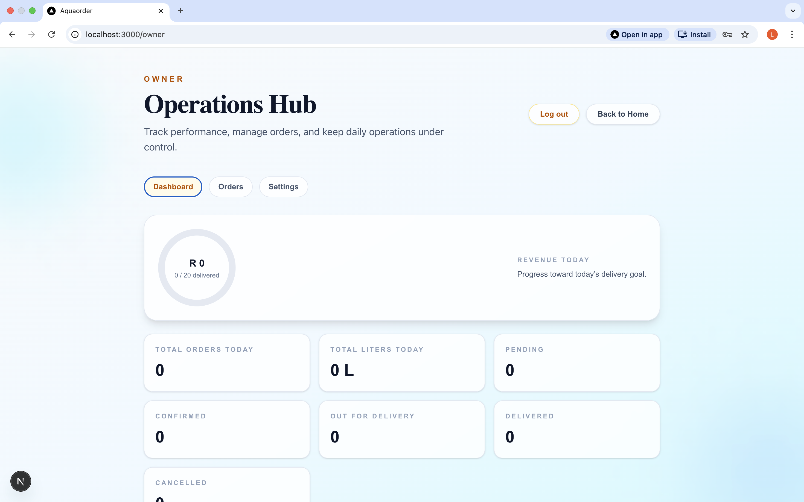
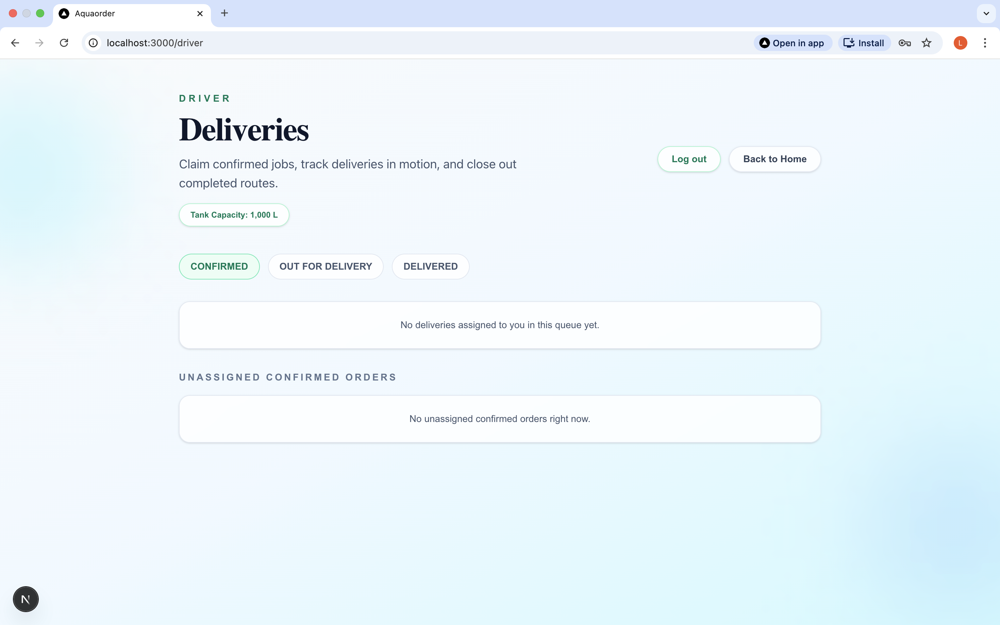
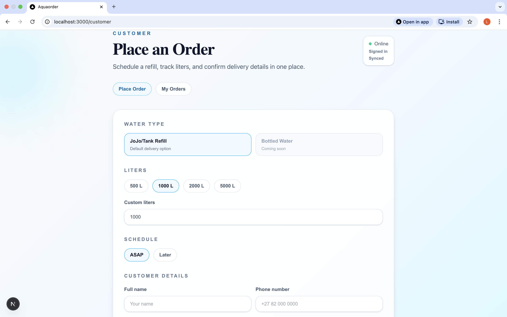
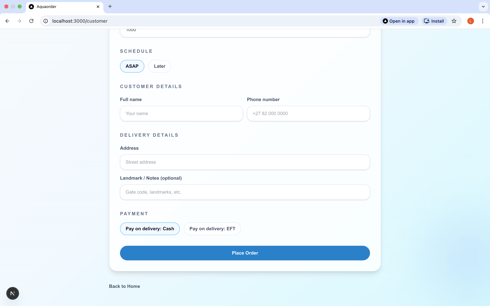
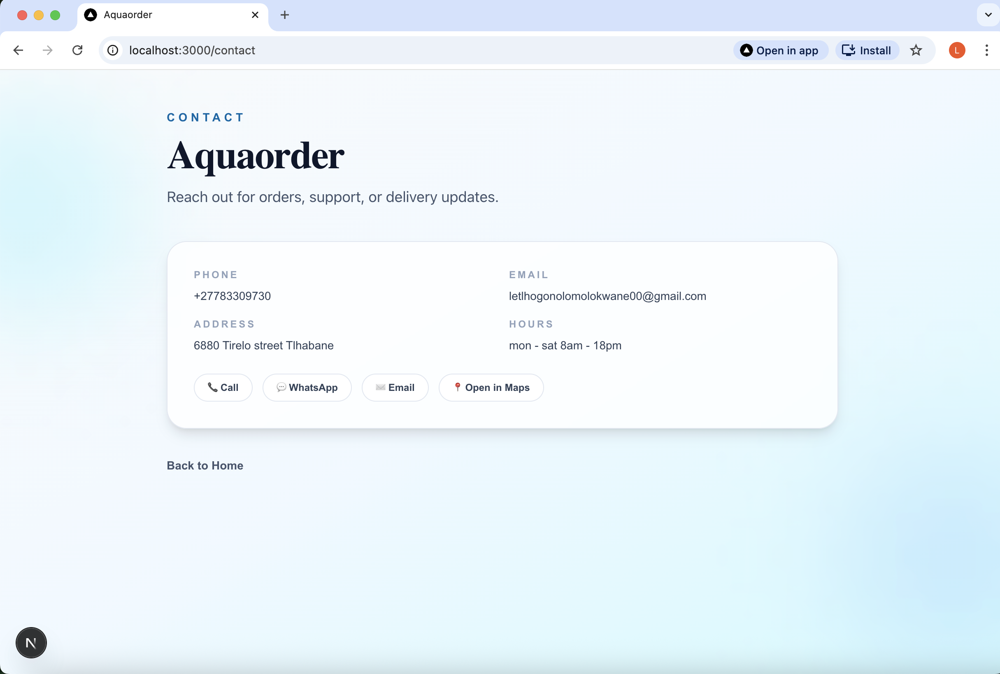

# Aquaorder

Aquaorder is a role-based water delivery management app built with Next.js, Firebase Auth, and Firestore.

Customers can place JoJo refill orders, drivers manage assigned deliveries, and owners manage operations, pricing, and business contact details.

## Live App

- Production: `https://aquaorder.vercel.app` 

## Features

- Customer order flow with status tracking
- Driver dashboard for assigned deliveries
- Owner dashboard for operations and settings
- Role-based access using Firestore user profiles
- Business contact page powered by Firestore settings
- Progressive Web App (PWA) support:
  - Web manifest
  - App icons
  - Apple web app metadata

## Tech Stack

- Next.js 16 (App Router)
- React 19
- TypeScript
- Tailwind CSS 4
- Firebase Auth
- Cloud Firestore
- `next-pwa`

## Routes

- `/` Home
- `/customer` Customer portal
- `/driver` Driver portal
- `/owner` Owner portal
- `/contact` Business contact page
- `/auth/driver` Driver login
- `/auth/owner` Owner login

## Environment Variables

Create `.env.local` in the project root:

```bash
NEXT_PUBLIC_FIREBASE_API_KEY=your_api_key
NEXT_PUBLIC_FIREBASE_AUTH_DOMAIN=your_auth_domain
NEXT_PUBLIC_FIREBASE_PROJECT_ID=your_project_id
NEXT_PUBLIC_FIREBASE_STORAGE_BUCKET=your_storage_bucket
NEXT_PUBLIC_FIREBASE_MESSAGING_SENDER_ID=your_sender_id
NEXT_PUBLIC_FIREBASE_APP_ID=your_app_id
NEXT_PUBLIC_FIREBASE_MEASUREMENT_ID=your_measurement_id
```


## Screenshots

### Home


### Owner portal



### driver portal


### customer form



### contact page

